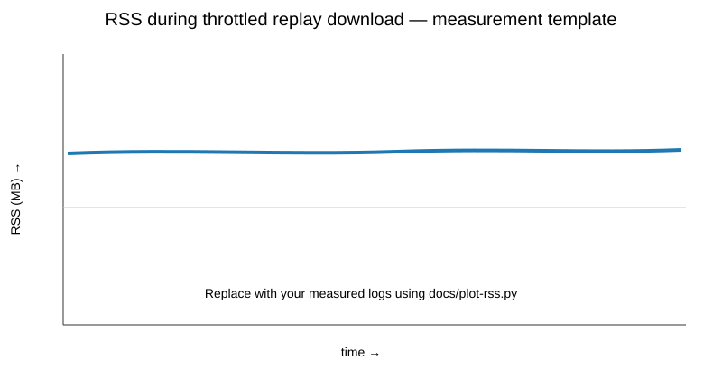

# Lab 04 — Node.js: EventEmitter, Streams and WebSocket Server

## Starship Arena

Продовження лабораторних 1–3 у тому самому репозиторії. У цій роботі клієнт гри розділено із сервером Node.js. Сервер керує кімнатами, WebSocket-підключеннями, чатом і логами матчу. Координати кораблів навмисно не передаються через мережу — це тема Lab 05.

## Що реалізовано

- npm workspaces: `client/` + `server/`;
- Node.js ESM із `node:` imports;
- `node:http` для static serving, `GET/POST /api/rooms`, `/health`, `/api/slow`;
- захист static paths від `..` path traversal;
- Vite proxy для `/api` та `/ws` у development;
- конфігурація через `.env` (`PORT`, `HOST`, `LOG_DIR` тощо) з перевіркою в `server/src/config.js`;
- graceful shutdown через `SIGINT` / `SIGTERM`;
- `Room extends EventEmitter`, `RoomManager` на `Map`, події `join`, `leave`, `chat`, `empty`, `event`;
- валідація WebSocket JSON protocol v0, `maxPayload`, rate limit і cap кімнат/гравців;
- join timeout 5 s;
- heartbeat: ping кожні 15 s, два пропущені pong → terminate;
- slow-client policy через `socket.bufferedAmount`;
- клієнтська WebSocket-обгортка з send queue та reconnect backoff;
- match logs як object-mode `Transform` → NDJSON → `pipeline` → файл;
- replay endpoint, який стрімить файл без читання всього логу в пам'ять;
- chat та roster у двох вікнах браузера;
- Lab 1–3 gameplay збережено на клієнті.

## Структура

```text
starship-arena-lab01/
├── package.json
├── .env.example
├── client/
│   ├── package.json
│   ├── vite.config.js
│   ├── index.html
│   ├── public/assets/
│   └── src/
│       ├── connection.js
│       ├── lobby/
│       ├── assets/
│       ├── sim/
│       └── render/
└── server/
    ├── package.json
    ├── src/
    │   ├── index.js
    │   ├── config.js
    │   ├── protocol.js
    │   ├── rate-limit.js
    │   ├── rooms.js
    │   ├── ws.js
    │   └── log/
    │       ├── matchlog.js
    │       └── replay.js
    ├── test/
    └── scripts/
```

## Запуск

У корені репозиторію:

```bash
npm install
```

Створи `.env` на основі `.env.example`.

### Development

Термінал 1:

```bash
npm run dev:server
```

Термінал 2:

```bash
npm run dev:client
```

Відкрити:

```text
http://localhost:5173
```

Vite передає `/api` і `/ws` на Node-сервер.

### Production

```bash
npm run build
npm start
```

Node-сервер віддає зібраний `client/dist`.

## WebSocket protocol v0

```json
{ "v": 0, "type": "join", "room": "alpha", "name": "Pilot" }
{ "v": 0, "type": "chat", "text": "hello" }
{ "v": 0, "type": "leave" }
```

Сервер відправляє `joined`, `roster`, `chat`, `errorMessage`, `left`.

На цьому етапі через сокет не передаються `x/y`, швидкість або кут корабля.

## EventEmitter і `error`

`Room` і `RoomManager` успадковують `EventEmitter`. Для кожного emitter, який може помилитися, встановлено слухач `error`.

Без слухача:

```js
const emitter = new EventEmitter();
emitter.emit("error", new Error("boom"));
```

Node вважає необроблену `error`-подію винятком і процес завершується. Зі слухачем процес продовжує роботу. У проєкті це продемонстровано також у `server/scripts/event-error-demo.js`.

## Node event loop і блокування 300 ms

Node виконує JavaScript на одному потоці. У спрощеному вигляді фази libuv можна показати так:

```text
timers → pending callbacks → poll (I/O) → check (setImmediate) → close
              ↑
      nextTick + promise microtasks
```

Endpoint:

```text
GET /api/slow?ms=300
```

навмисно займає main thread busy-loop приблизно на 300 ms. Поки цикл заблокований, інший HTTP/WebSocket handler не отримує виконання JavaScript. Це практична демонстрація того, чому CPU-bound синхронний код на сервері затримує всіх клієнтів.

Додатковий порядок можна перевірити:

```bash
node server/scripts/event-loop-demo.js
```

`process.nextTick` і promise reaction мають стабільний пріоритет над звичайними task callbacks; `setTimeout(0)` і `setImmediate` з головного модуля можуть міняти порядок залежно від запуску. Усередині I/O callback `setImmediate` має передбачуваніше місце в циклі.

## Backpressure і match logs

Кожна кімната має match log. Події кімнати проходять через:

```text
Room event
   ↓
Readable.from(async generator)
   ↓
Transform (object → NDJSON line)
   ↓
pipeline()
   ↓
createWriteStream(LOG_DIR/...ndjson)
```

Для replay використовується `createReadStream` і `pipeline(readStream, response)`. Весь файл не завантажується в RAM.

Backpressure означає, що швидкий producer не повинен безмежно накопичувати дані, якщо consumer повільний. У Node `writable.write()` повертає `false`, коли внутрішній buffer досяг `highWaterMark`; producer повинен чекати `drain`. `pipeline` автоматично зв'язує потоки та обробляє завершення/помилки.

## RSS experiment

Згенерувати синтетичний лог:

```bash
node server/scripts/generate-log.js 200 ./logs/synthetic-200mb.ndjson
```

У другому терміналі запустити монітор пам'яті:

```bash
node server/scripts/rss-monitor.js 30000 250 ./logs/rss.csv
```

Запустити сервер та скачати replay:

```text
http://localhost:3001/api/replays/synthetic-200mb.ndjson
```

У Chrome DevTools → Network увімкнути повільне підключення, щоб replay ішов через throttled channel. Після завершення побудувати графік:

```bash
python docs/plot-rss.py logs/rss.csv
```

Після вимірювання скрипт `docs/plot-rss.py` створює `docs/rss-backpressure.png`. Перед здачею замініть шаблон на власний виміряний графік. Крива має залишатися приблизно пласкою, а не рости пропорційно до розміру файлу.



### Мої вимірювання

| Показник           | Результат |
| ------------------ | --------: |
| synthetic log size |    ___ MB |
| download duration  |     ___ s |
| min RSS            |    ___ MB |
| max RSS            |    ___ MB |
| delta RSS          |    ___ MB |

## Що перевірив

```bash
npm run lint
npm run format:check
npm run build
npm test
```

Два браузерні вікна мають зайти в одну кімнату. На обох вікнах видно однаковий roster; повідомлення чату з одного вікна з'являються в іншому.

## Git

Для кожної лабораторної використовується окрема гілка та Pull Request:

```text
main
 ├── lab-01 → tag lab-01
 ├── lab-02 → PR → main → tag lab-02
 ├── lab-03 → PR → main → tag lab-03
 └── lab-04 → PR → main → tag lab-04
```

Після merge цієї лабораторної:

```bash
git switch main
git pull origin main
git tag lab-04
git push origin refs/tags/lab-04
```

## Висновок

У Lab 04 я виніс гру в npm workspace `client/server` і додав Node.js сервер з HTTP API, EventEmitter-кiмнатами, WebSocket join/leave/chat, heartbeat, rate limiting та backpressure policy. Логи матчів пишуться потоками NDJSON, а replay віддається клієнту через `pipeline` без буферизації всього файлу. Код усе ще не передає координати гри по мережі — це залишено для Lab 05.
